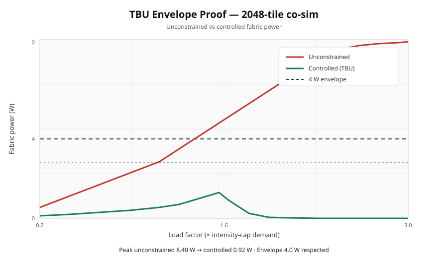

# Ultra-Low-Power 6G Baseband Architecture

**2048-Tile Fabric • Sub-THz Target • ≤ 4 W Envelope • Continuous TBU Control**

## Envelope proof (co-sim, 2048 tiles)

| Metric | Value |
|--------|--------|
| Unconstrained over-subscription peak | **8.4 W** |
| Controlled peak (TBU + prune + intensity) | **0.92 W** |
| Thermal envelope | **4.0 W — respected** |
| Intensity-cap design power | **2.8 W** |

*Red: unconstrained · Green: controlled · Dashed: 4 W envelope*
Reproduce:

    bash scripts/run_envelope_demo.sh

Or:

    PYTHONPATH=python python3 python/cosim/harness.py

Two cooperating loops: continuous thermal boundary control (TBU) and algorithmic intensity reduction (pruning + approximate compute). Aim: sustained high-throughput baseband inside a mobile thermal budget — not peak-rate slides.

### Scope note (12–15×)

The **12–15×** figure is an **ops-intensity** target (pruning + approximate arithmetic on kernel work). It is **not** a full system energy claim including SRAM/DRAM and control overhead. Memory-bound phases will see less end-to-end reduction; worst-case net energy benefit can land nearer **~1.5–3×**. The hard thermal claim is the **≤ 4 W** envelope under the control policy above.

---

## Core idea

1. **Thermal containment (TBU / TBCU)**  
   Total power is treated as an action potential. A continuous boundary measure generates throttle factors that keep the fabric near or under **4 W**.

2. **Algorithmic intensity reduction**  
   Under thermal pressure the fabric increases approximate arithmetic and pruning, cutting effective operations.

Closed loop: load rises → power approaches the envelope → throttle + pruning increase → intensity drops → fabric stays inside budget.

---

## What is implemented

| Layer | Blocks |
|-------|--------|
| **Theory** | Topological Boundary Unit mathematics (`python/tbu/`) |
| **Energy** | Calibrated model – 0.10 pJ/op, intensity caps, envelope (`python/power/`) |
| **Thermal RTL** | TBCU, regional TBCU, multi-cycle power reduce |
| **Intensity RTL** | Approx ALU, pruning controller |
| **Kernels** | FFT butterfly, OFDM stage/pipeline, channel EQ, soft demap, TX map/IFFT, MIMO stub |
| **Tiles** | Compute tile, DSP tile, PHY tile (TX/RX) |
| **Hierarchy** | Fabric slice → multi-slice → configurable full fabric (`NUM_TILES` up to 2048) |
| **NoC** | Hierarchical address map + skeleton |
| **Safety** | Assertion package + bind example |
| **Proof** | Co-sim harness + envelope stress testbenches |
| **Docs** | TBU mapping, elaboration plan, build status |

---

## Quick start

    bash scripts/run_envelope_demo.sh

    PYTHONPATH=python python3 python/cosim/harness.py

Requires: Python 3.10+, numpy (`pip install -r requirements.txt`).

---

## Repository map

    python/
      tbu/           continuous boundary mathematics
      power/         calibrated energy model + fabric power model
      cosim/         software twin / envelope harness
    rtl/
      common/        parameters + assertions
      tile/          compute, DSP, PHY tiles, intensity limiter, approx ALU
      tbc/           TBCU, regional TBCU, power reduce
      kernels/       FFT, EQ, demap, TX, MIMO
      optim/         pruning controller
      noc/           address map + hierarchical skeleton
      top/           slice, multi-slice, full configurable fabric
    sim/             directed + stress testbenches
    docs/            TBU framework, elaboration plan, status
    scripts/         run_envelope_demo.sh

---

## Key numbers

| Metric | Value |
|--------|--------|
| Tiles | 2048 (parameterised) |
| Thermal envelope | ≤ 4 W |
| Energy per op (model) | ~0.10 pJ |
| Local intensity cap | ≤ 700 ops / transistor |
| Ops-intensity target | 12–15× (prune + approx; see scope note) |
| Target useful workload | ≤ 2.6 × 10¹³ ops/s |

---

## Status

Working hierarchical RTL and software twin demonstrating the closed thermal/intensity control loop, with a full TX/RX PHY path (2×2 ZF MIMO + polar coding) under TBU control. Envelope proof: 8.4 W unconstrained → 0.92 W controlled.

Next: optional memory-energy term, then larger NUM_TILES elaboration.
Next: expand MIMO into the RX chain, optional memory-energy term in the model, channel-coding stub, then larger NUM_TILES elaboration.

---

## Citation

Jade Siley-Winditt – Ultra-Low-Power 6G Baseband Architecture (2048-tile fabric, ≤ 4 W)

Jade Siley-Winditt – The Topological Boundary Unit (TBU): A Unified Mathematical Framework for Boundary-State Dynamics (2026)

---

## License

Copyright © 2026 Jade Siley-Winditt. All rights reserved.

Research and educational use only. No commercial use, reproduction, modification, or silicon fabrication without prior written permission.
